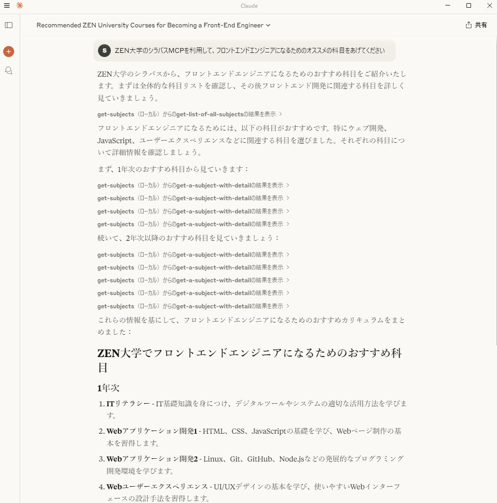
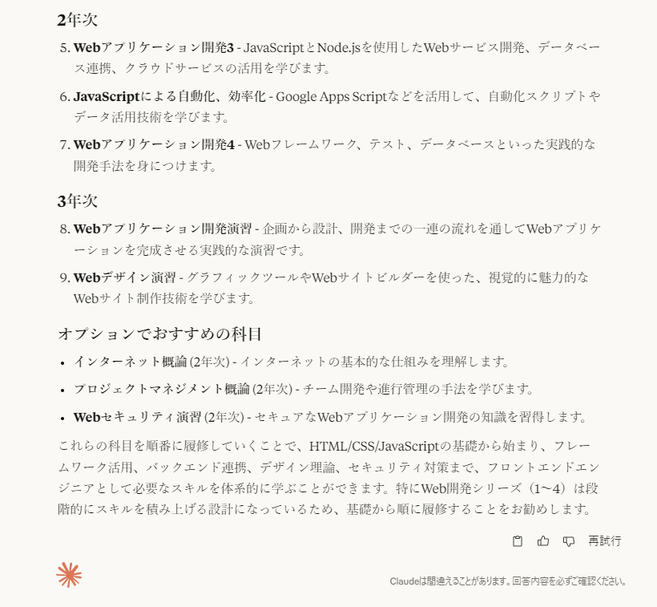

# ZEN大学シラバスMCPサーバー実装 

[ZEN大学シラバス](https://syllabus.zen.ac.jp/)のコンテンツを利用できるようMCPを実装したもの。

## 使い方
[Node.js](https://nodejs.org/)をインストールする。
Node.jsのバージョンは20以上を使用すること。

このリポジトリをクローンするか、ZIPでダウンロードして展開する。
コンソールで開き、以下のコマンドを実行する。

```
npx tsc
```

でビルド。Macはコンソールで実行権限をつける。 `chmod 755 build/index.js`

## Claude Desktopでの設定

[Claude Desktop](https://claude.ai/download)をインストールする。
[VSCode](https://azure.microsoft.com/ja-jp/products/visual-studio-code)のエディタがインストール前提だが、

```
code $env:AppData\Claude\claude_desktop_config.json
```
で設定ファイルを開く。Macは、

```
code ~/Library/Application\ Support/Claude/claude_desktop_config.json
```

以下のように書き換えて設定。

```
{
  "mcpServers": {
      "get-subjects": {
          "command": "node",
          "args": [
              "C:\\Users\\sifue\\workspace\\zen-syllabus-mcp\\build\\index.js"
          ]
      }
  }
}
```

`build/index.js`のパスは適宜変更すること。


Macでは、

```
{
  "mcpServers": {
      "get-subjects": {
          "command": "node",
          "args": [
              "/Users/sifue/workspace/zen-syllabus-mcp/build/index.js"
          ]
      }
  }
}
```

`build/index.js`のパスは適宜変更すること。

設定後はClaude Desktopを再起動。

「ZEN大学のシラバスMCPを利用して、フロントエンドエンジニアになるためのオススメの科目をあげてください」

で検証。




このようになる。履修要件を設定すれば細かな履修相談も可能。

## VSCodeの設定
【未検証】いずれGitHub Copilot でAIエージェントが利用できるようなると利用できるらしい(現在はプレビュー版のみ)。
mcpで設定を検索して以下をsetting.jsonに設定。パスは適宜変更すること。jsonのweatherの上に起動ボタンが現れるので起動しておく。

```json
{
  "mcpServers": {
      "get-subjects": {
          "command": "node",
          "args": [
              "C:\\Users\\sifue\\workspace\\zen-syllabus-mcp\\build\\index.js"
          ]
      }
  }
}
```

設定後はGitHub Copilotで

「ZEN大学のシラバスMCPを利用して、フロントエンドエンジニアになるためのオススメの科目をあげてください」

で検証。履修要件を設定すれば細かな履修相談も可能。

## サーバー実装時の動作確認

詳しくは、[TypeScript SDK](https://github.com/modelcontextprotocol/typescript-sdk)のClientの実装を参照。

```
node build/index.js
```
でサーバーを起動。

```
node .\build\client.js
```
でクライアントを起動して実行。

クライアントは検証したいコードに合わせて書き換え、その後、
```
npx tsc
```
でビルドして再度クライアントを実行する。


## 参考
- [MCPのQuickStart](https://modelcontextprotocol.io/quickstart/server)
- [VSCodeのMCP設定](https://code.visualstudio.com/docs/copilot/chat/mcp-servers)